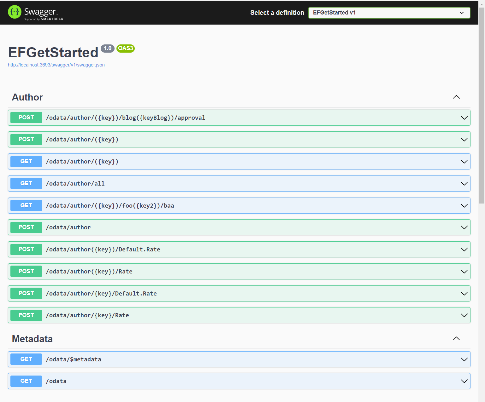

# Purpose

To explorer the latest and greatest of Entity Framework 7.0, OData 8.0 and .NET 6.0 resulting from challenges from migrating .NET Core 3.1 git repositories to .NET 6.0, prior to _end of support_ of LTS for .NET Core 3.1.

## Swagger

This example shows both Convention and Attribute routing:

# References

- [Notes on Convention and Attribute Routing](https://devblogs.microsoft.com/odata/routing-in-asp-net-core-8-0-preview/#odata-routing)